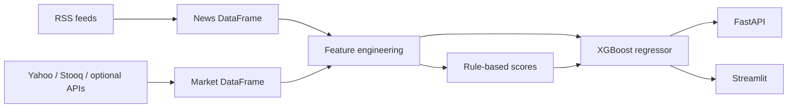

# Supplier Risk Intelligence

End-to-end pipeline that combines **ingestion from public market and news sources**, **rule-based and weakly supervised ML scoring**, and **delivery through an API and executive dashboard**. Built to demonstrate how a lean analytics team can turn unstructured headlines plus structured price data into a **repeatable supplier risk signal**—without relying on proprietary datasets or mocked financials.

**Repository:** [github.com/KV0217/supplier-risk-intelligence](https://github.com/KV0217/supplier-risk-intelligence)

**Example hosted instances (may change with redeploys):**

- Dashboard: [supplier-risk-intelligence-kv.streamlit.app](https://supplier-risk-intelligence-kv.streamlit.app)
- API base: [supplier-risk-intelligence-1.onrender.com](https://supplier-risk-intelligence-1.onrender.com)
- OpenAPI docs: [supplier-risk-intelligence-1.onrender.com/docs](https://supplier-risk-intelligence-1.onrender.com/docs)

---

## Why this matters (analyst lens)

Procurement and supply-chain teams care about **early signals**: supplier distress often appears in news and price behaviour before it shows up in internal systems. This project shows how to:

- Ingest **noisy, delayed, and heterogeneous** public data.
- Engineer **interpretable features** aligned to risk (coverage, sentiment shape, volatility, trend, range position).
- Produce a **scalar risk score (0–100)** and tiered labels suitable for triage, not for automated contractual decisions without human review.
- Expose the same logic through **UI and REST** for different consumers.

---

## What the system does

| Layer | Description |
|--------|-------------|
| **News** | RSS ingestion from multiple publishers (e.g. Bloomberg, Reuters, CNBC, MarketWatch, TechCrunch; configurable in `config.py`). Articles are filtered when monitored supplier names appear in title or summary. |
| **Market data** | **Real** daily price history—**no mock financial series**. Per ticker, the collector tries providers in order: Yahoo Finance (`yfinance`) → Stooq (CSV backup) → optional Twelve Data / Alpha Vantage / Finnhub if API keys are set. Each row records `data_source` for auditability. |
| **Scoring** | Baseline: keyword + TextBlob sentiment → news risk; volatility / trend / 52-week position → financial risk; weighted composite with article-count-aware weights. **ML:** XGBoost regressor on engineered features; labels bootstrapped via weak supervision from the baseline when explicit disruption labels are unavailable. |
| **Consumption** | Streamlit app (`app.py`) and FastAPI service (`api.py`) share the same scoring engine. |

---

## Data provenance and limitations

Public data is real, but **not equivalent to a paid terminal or internal master data**.

- **News:** RSS reflects what each outlet exposes in the feed; latency and completeness vary. Cloud IP blocks can occasionally reduce volume.
- **Prices:** Free routes are commonly **delayed** (often ~15 minutes for many US listings) or **end-of-day** depending on symbol and provider. Stooq and Yahoo may disagree slightly; the pipeline prefers the first successful source per ticker and logs which one was used.
- **Coverage:** The monitored universe is the **ticker list in `config.py` (`STOCK_TICKERS`)**, not “hundreds of suppliers” unless you extend that mapping yourself.

Explicit gaps are preferable to synthetic fills: if every provider fails for a ticker, that name is omitted rather than imputed with fabricated prices.

---

## Methodology (how scores are built)

### News signal

- Text features: title + summary; lexicon-weighted risk terms blended with TextBlob polarity when available.
- Aggregates: average sentiment per supplier, article count, distributional stats used downstream for ML features.

### Financial signal

- From ~1 year of closes: realized volatility (std of daily returns), trailing trend, and position relative to rolling high/low band used in the rule-based financial risk component.

### Composite and ML

- **Rule-based composite:** Dynamic news vs. financial weighting (caps apply) preserves a transparent baseline suitable for stakeholder explanation.
- **XGBoost:** Trains on engineered features (news risk, financial risk, article count, sentiment moments, volatility, trend, range position, etc.) with **weak labels** = baseline composite scores when true disruption labels are not available—a practical bridge until you have curated historical incidents.
- **Persistence:** Trained model can be saved and reloaded (`xgboost_risk_model.pkl`) for consistent inference across runs.

Severity buckets (e.g. CRITICAL ≥ 75) are configurable thresholds aimed at **ops triage**, not regulatory capital models.

---

## Architecture (high level)



---

## Repository layout

| Path | Role |
|------|------|
| `data_collector.py` | News RSS + multi-provider financial ingestion; `data_source` column on financial rows. |
| `risk_scoring.py` | Sentiment, financial rules, composite logic, XGBoost train/infer, optional model I/O. |
| `app.py` | Streamlit monitoring UI. |
| `api.py` | FastAPI REST surface for programmatic scoring. |
| `config.py` | RSS list, tickers, thresholds. |
| `requirements.txt` | Pinned dependencies (includes `fastapi`, `uvicorn`, `xgboost`). |

---

## Quick start

```bash
git clone https://github.com/KV0217/supplier-risk-intelligence.git
cd supplier-risk-intelligence
python -m venv venv
# Windows: venv\Scripts\activate
# macOS/Linux: source venv/bin/activate
pip install -r requirements.txt
```

```bash
streamlit run app.py
```

```bash
uvicorn api:app --host 0.0.0.0 --port 8000
```

Optional resilience for production-style deploys (set as environment variables):

- `TWELVE_DATA_API_KEY`
- `ALPHA_VANTAGE_API_KEY`
- `FINNHUB_API_KEY`

---

## Deployment (reference)

Typical pattern: **Streamlit Community Cloud** for the dashboard and **Render** (or similar) for the API, with Python version pinned via `runtime.txt` / `.python-version` as in-repo. After changes, redeploy so dependency updates (e.g. `uvicorn`, `xgboost`) are picked up.

---

## How a senior analyst would extend this

- **Ground truth:** Replace weak labels with incident logs (late delivery, quality holds, bankruptcy, force majeure) and retrain with proper train/validate split and calibration.
- **NLP:** Move from lexicon + TextBlob to domain-finetuned transformers once you have even a few hundred labelled headlines.
- **Governance:** Model cards, data freshness SLAs, and drift checks on feature distributions (`data_source` mix, article volume, volatility regime).
- **Data warehouse:** Land raw articles and quotes in **Snowflake / BigQuery**, version features, and schedule scoring (Airflow / cloud jobs).

---

## License and data use

Project code is suitable for portfolio and learning. **Respect each publisher’s terms** for RSS and each market data provider’s terms of use. This is not investment advice; scores are **decision-support** prototypes.

---

## Author

Maintained as a portfolio-quality analytics and engineering reference. For the canonical remote and CI/CD wiring, use the GitHub repository linked at the top of this file.
