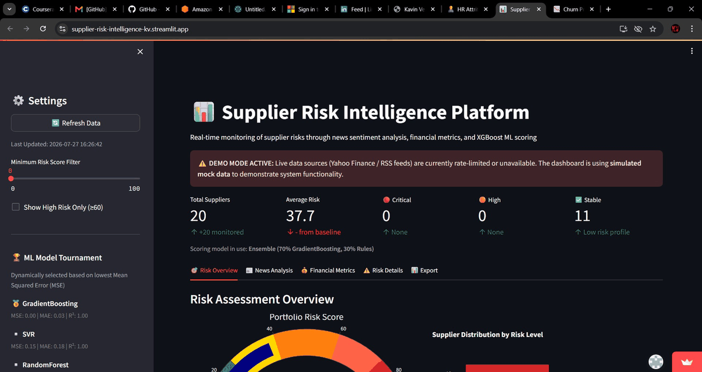

  <h1>🏭 Supplier Risk Intelligence System</h1>
  

       
  

  
<em>End-to-End Supplier Risk Modeling utilizing Isolation Forests, KMeans Clustering, and AWS S3 Cloud Archiving.</em>

---

## 📸 Application Screenshots

  

## 🌟 Architecture & Features
- ☁️ **AWS S3 Cloud Archiving:** Automatically compresses and streams JSON risk reports directly to an AWS S3 bucket for persistent versioned storage and auditing.
- 🌳 **Isolation Forest Anomaly Detection:** Real-time flagging of severe outlier suppliers demonstrating chaotic delivery delays and critical defect rates.
- 🧬 **KMeans Risk Clustering:** Segmentation of the supply chain ecosystem into actionable risk tiers (Low, Medium, High).
- 📈 **Interactive Dashboards:** Visualizations built via `Plotly` and `Dash` projecting geographic risk maps and temporal delivery defect patterns.
- 📊 **Feature Engineering Framework:** Robust computation of Defect-to-Delivery ratios and historical reliability weights.

## 🛠️ Technology Stack
Scikit-Learn · Isolation Forests · KMeans · AWS S3 · Boto3 · Pandas · NumPy · Plotly · Dash

## 📊 Core Analytical Pipeline
1. **Data Ingestion:** Merges disparate geographical, defect, and delivery timeline datasets.
2. **Feature Generation:** Computes custom composite metrics representing holistic vendor reliability.
3. **Unsupervised Learning:** Deploys Isolation Forests to isolate 1-5% of high-risk outliers.
4. **Cloud Export:** Uploads audit-compliant compressed analytical reports straight to AWS infrastructure.

---

  <b>Built by Kavin Venkat</b>  
  <a href="https://www.linkedin.com/in/kvsherly17100210">LinkedIn</a> • <a href="https://github.com/KV0217">GitHub</a>

